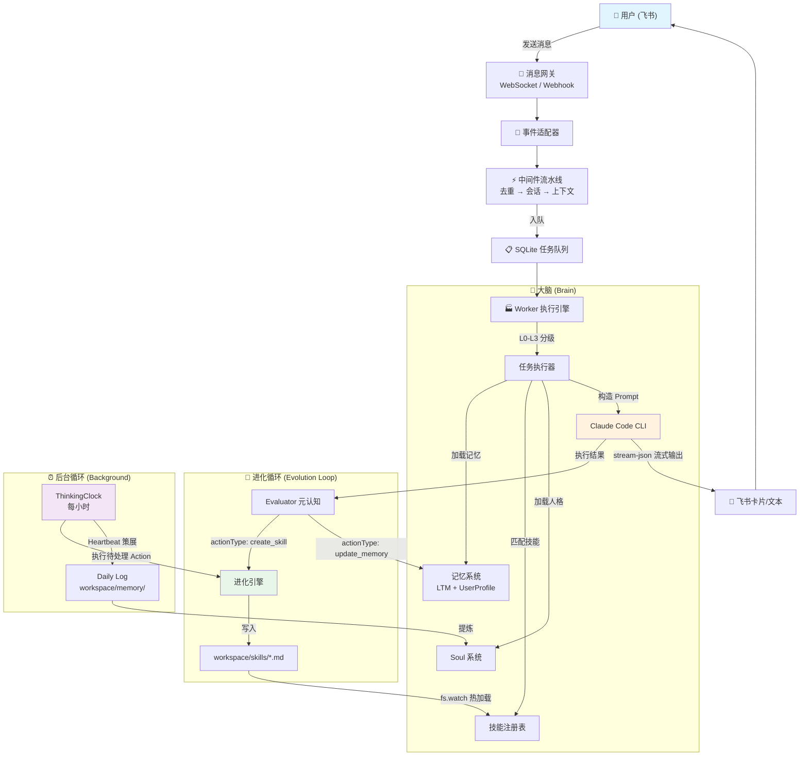
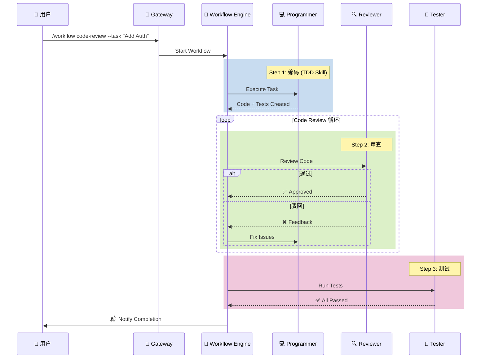
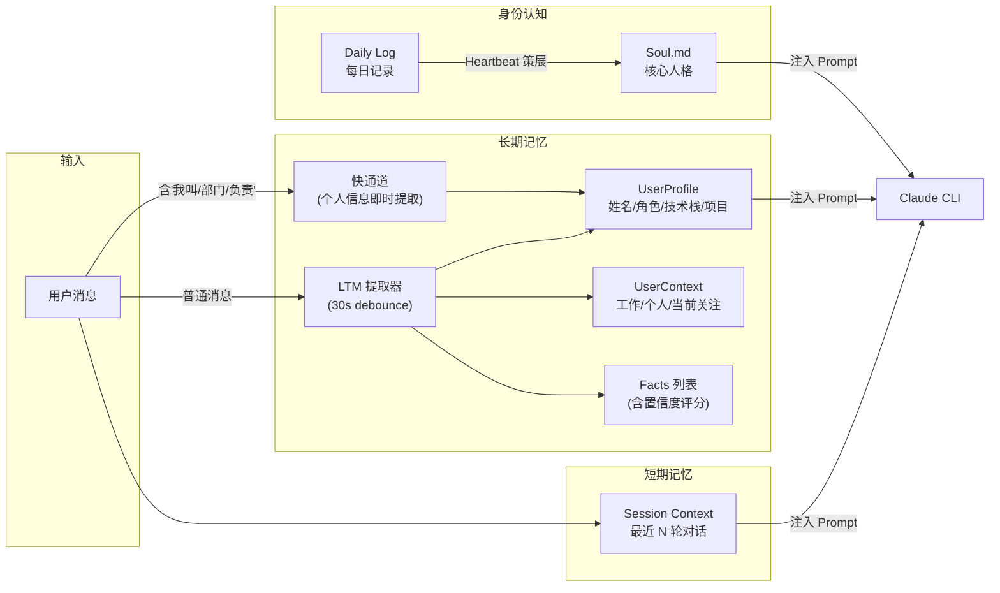

# Wukong Bot v2.1 — 自主进化的飞书 AI Agent

<p align="center">
  <strong>飞书机器人 × Claude Code CLI × 自我进化引擎</strong><br/>
  一个运行在本地机器上的全权限 AI 数字员工，具备<b>自主执行</b>、<b>长期记忆</b>与<b>自我进化</b>能力。
</p>

> 架构设计参考 [bytedance/deer-flow](https://github.com/bytedance/deer-flow) · 认知循环灵感来自 [OpenClaw](https://github.com/anthropics/anthropic-cookbook)
>
> **WebSocket 长连接模式**支持，无需内网穿透即可本地开发！

---

## 目录

- [概述](#概述)
- [核心能力](#核心能力)
- [系统架构](#系统架构)
- [架构图](#架构图)
- [项目结构](#项目结构)
- [快速开始](#快速开始)
- [配置说明](#配置说明)
- [使用指南](#使用指南)
- [扩展开发](#扩展开发)
- [部署与运维](#部署与运维)
- [数据库设计](#数据库设计)
- [注意事项](#注意事项)
- [License](#license)

---

## 概述

Wukong Bot 不是一个普通的聊天机器人，而是一个**运行在你本地机器上的全权限 AI Agent**。它通过飞书消息接收指令，调用 Claude Code CLI 执行任务，拥有与开发者完全相同的操作系统权限——可以读写文件、执行命令、操作 Git、部署服务。

更重要的是，Wukong Bot 具备**自我进化能力**：它会在完成复杂任务后自动总结经验、生成可复用的技能文件；通过 ThinkingClock 后台巡检器定期策展记忆；通过 Evaluator 元认知循环反思每次执行的质量。随着使用时间增长，Bot 会变得越来越"聪明"。

### 技术栈

| 组件 | 技术选型 | 说明 |
|------|---------|------|
| 运行时 | Bun | 高性能 TypeScript 运行时，内置 SQLite/WebSocket |
| AI 引擎 | Claude Code CLI | Anthropic 的 CLI Agent，支持 stream-json 流式输出 |
| 模型代理 | 字节跳动 Ark API | 本地代理转发，兼容 Anthropic 图片格式 |
| 消息通道 | 飞书 WebSocket / Webhook | 双模网关，WebSocket 无需内网穿透 |
| 持久化 | SQLite (bun:sqlite) | 任务队列、会话、记忆、定时任务、工作流状态 |
| 进程管理 | PM2 | 生产环境部署与守护 |

### 代码规模

- **源码**：~11,000 行 TypeScript（30+ 模块）
- **核心文件**：`executor.ts`（863 行）、`workflow/engine.ts`（570 行）、`long_term_memory.ts`（488 行）

---

## 核心能力

### 1. 通信与交互（Senses）

**双模消息网关** — 支持两种事件源接入飞书：

- **WebSocket 长连接**（推荐）：基于 `@larksuiteoapi/node-sdk` 的 WSClient，无需公网 IP 或内网穿透，开箱即用于本地开发。消息通过飞书官方 WebSocket 通道实时推送，延迟 < 100ms。
- **Webhook 回调**：标准 HTTP POST 方式，适用于生产环境部署。内置 Express/Hono 网关层，支持事件签名验证。

**飞书富文本交互**：
- **智能卡片**：长任务自动显示带进度条的交互卡片（Pending → Processing → Completed/Failed），使用基于指数曲线的进度估算器实现平滑推进（40% → 95%）。
- **Markdown 渲染**：完整支持代码块（语法高亮）、列表、表格、加粗/斜体等格式。针对飞书卡片的 Markdown 换行兼容性做了专项适配。
- **纯文本智能切换**：简短回复自动使用 reply 模式（减少一次 API 调用），复杂回复使用卡片模式。

**Typing 指示器**：
- 基于飞书表情 Reaction API 实现 "正在输入" 动画效果。
- 10 秒 keepalive 刷新机制保持可见性（相比初始 3 秒方案减少 ~70% API 调用）。
- 内置限流熔断（支持 429 / 99991400 / 99991403 错误码自动退避）。

### 2. 大脑与执行（Brain & Hands）

**Claude Code CLI 封装**（`src/agent/index.ts`）：
- **全权限终端执行**：Bot 运行在你的机器上，拥有和你一样的操作系统权限。它可以执行 `git pull`、`npm install`、修改代码文件、重启服务——没有沙箱限制。
- **stream-json 流式解析**：实时解析 CLI 的 `--output-format stream-json` 输出，提取思考过程、工具调用、最终回复。三层结果提取防御机制确保回复不丢失。
- **Session 复用**：记录 Claude CLI 的 Session ID，后续对话通过 `--resume` 复用上下文，节省 ~3000-5000 tokens/轮。
- **本地代理模式**：内置 Express 代理服务器将 Anthropic 格式请求转发到字节跳动 Ark API，支持图片 Base64 格式自动转换。

**四级任务分类**（`src/worker/executor.ts`）：

| 级别 | 类型 | System Prompt | Evaluator | 典型场景 |
|------|------|---------------|-----------|----------|
| L0 | `greeting` | 无需 CLI | 跳过 | "你好"、"谢谢" |
| L1 | `simple` | 轻量（Soul 人格） | 跳过 | "今天星期几" |
| L2 | `chat` | 中等（人格 + 用户画像 + 记忆） | 跳过 | "我叫 Alice，负责测试" |
| L3 | `complex` | 完整（全部工具文档） | 启用 | "帮我写一个 API 模块" |

**任务队列**（`src/queue/index.ts`）：
- 基于 SQLite 的持久化任务队列，支持并发控制（默认 3 个 worker）。
- 崩溃恢复：服务重启后自动捞取 `pending` 状态的任务继续执行。
- AbortController 信号传递，支持用户级任务取消。

### 3. 记忆系统（Memory）

Wukong Bot 实现了三层记忆架构，确保 AI 对用户的理解随时间持续加深：

**短期记忆 — Context Window**（`src/session/index.ts`）：
- 维护最近 N 轮对话上下文（可配置），通过 Claude CLI Session 机制实现连续对话。
- Session Key 设计：`{userId}:{chatId}` 确保同一用户在不同群聊中有独立上下文。

**长期记忆 — LTM + UserProfile**（`src/session/long_term_memory.ts`）：
- **智能去抖提取**：消息入队后等待 30 秒（debounce），将多条消息合并成一次 LLM 调用提取记忆，减少 API 成本。
- **即时提取快通道**：检测到自我介绍类消息（包含"我叫"/"部门"/"负责"等关键词）时，绕过 debounce 立即触发记忆提取，确保个人信息不丢失。
- **结构化存储**：提取 UserContext（工作/个人/当前关注）+ UserProfile（姓名/角色/技术栈/项目/沟通风格）+ Facts（事实列表，含置信度评分）。
- **用户画像文件**：每个用户在 `workspace/users/{openId}.md` 有独立的 Markdown 画像文件，格式化后注入 System Prompt。

**身份认知 — Soul System**（`src/soul/index.ts`）：
- 对标 OpenClaw 的 SOUL.md 设计：每个 Agent 有独立的灵魂文件，定义核心人格、使命、行为约束。
- 支持 `[UPDATE_SOUL]` 指令让 Agent 自主修改自己的灵魂。
- ThinkingClock 每次 tick 自动重读 Soul 文件，保持人格一致性。

**Daily Log**（`src/workspace/daily-log.ts`）：
- 每天一个 Markdown 文件（`workspace/memory/YYYY-MM-DD.md`），Append-only。
- 记录对话摘要、关键决策、学到的信息。
- Heartbeat 策展机制将重要信息提炼进 Soul.memories。

### 4. 技能与进化（Skills & Evolution）

这是 Wukong Bot 最核心的差异化能力——使其具备**自我成长**的闭环：

**动态技能加载**（`src/skills/loader/index.ts`）：
- 使用 `fs.watch` 监听 `workspace/skills/` 目录。一旦有新文件生成、修改或删除，**无需重启服务**，Bot 立即学会/更新/遗忘对应技能。
- 支持多种触发方式：命令触发（`/deploy`）、关键词触发（"部署"）、正则触发。
- 技能文件是纯 Markdown 格式，对版本控制友好。

**元学习 — Meta-Learning**（`src/evolution/index.ts`）：
- 当 Bot 解决了一个复杂问题（如"部署流程"），Evaluator 会判断是否值得沉淀为技能。
- 如果判定 `actionType: 'create_skill'`，Evolution Engine 自动调用 LLM 生成 SkillSpec → 写入 `workspace/skills/` → 技能即时生效。
- **教学闭环**：用户教一遍 → Bot 自动总结 → 生成 Skill 文件 → 下次直接调用。

**Evaluator 元认知循环**（`src/reflection/evaluator.ts`）：
- 仅对 `complex` 级别任务启用（`chat`/`simple`/`greeting` 跳过，避免无谓开销）。
- 三级评估：确定性检查（执行成功/失败）→ 启发式检查（JSON 格式/文件存在性）→ LLM 深度评估。
- 评估结果包含 score、critique、insight、actionType，一次 LLM 调用完成全部分析。
- `chat` 和 `simple` 任务使用 fire-and-forget 模式，不阻塞用户回复。

**ThinkingClock 后台巡检**（`src/clock/index.ts`）：
- 每小时自动执行一次后台循环（可配置）。
- 扫描未处理的 Evaluator actionable_item 并执行（创建技能/更新记忆）。
- Heartbeat 策展：DailyLog → Soul.memories 的自动提炼。

### 5. 多智能体协作（Multi-Agent Collaboration）

混合架构："确定性工作流编排 + 动态 Agent 通信"。

**Agent 注册表**（`src/workspace/agents.ts`）：
- `workspace/agents/` 目录下每个 Agent 一个 `.md` 文件，定义身份、能力、工具权限、通信规则。
- 内置 `main`（通用 Agent），可扩展 `programmer`、`reviewer`、`tester` 等角色。
- 每个 Agent 拥有独立 System Prompt 和技能集。

**工作流引擎**（`src/workflow/engine.ts`）：
- 确定性编排器：流程控制（依赖/条件/循环/重试）完全由代码控制，LLM 只负责执行每个步骤。
- JSON 声明式定义：`workspace/workflows/*.workflow.json`。
- 支持步骤间数据传递（通过 Agent Messages + 模板变量）。
- 状态持久化：工作流运行状态存储在 SQLite，支持崩溃恢复。

**Agent 间通信**：
- 基于 `agent_messages` 表的异步消息传递。
- 每条消息包含 fromSession、toSession、correlationId，支持请求-响应模式。

### 6. 定时任务与提醒（Cron）

- 自然语言解析：用户发送"每天早上 9 点提醒我 xxx"，自动解析为 cron 表达式。
- 支持 `[SCHEDULE_TASK]` 指令由 Claude 自主创建定时任务。
- 一次性延时提醒和周期性循环任务均支持。
- 持久化到 SQLite，服务重启后自动恢复调度。

### 7. 安全与确认（Safety）

- **危险操作拦截**（`src/confirmation/index.ts`）：检测 `rm -rf`、`git push --force`、`DROP TABLE` 等高危命令，自动弹出确认卡片。
- **SAFETY_PROMPT**：注入安全指令，约束 Claude 的行为边界。
- **权限跳过优化**：`greeting` 和 `simple` 任务不注入 SAFETY_PROMPT，减少噪音。

### 8. 可观测性（Observability）

- **多级日志**（`src/utils/logger.ts`）：debug / log / info / warn / error 五级，同时输出到控制台和日期轮转文件（`workspace/logs/YYYY-MM-DD.log`）。
- **Token 使用统计**（`src/stats/`）：每日自动统计 input/output tokens、缓存命中率、任务数量，支持飞书卡片推送。
- **Session 录制**（`src/session/recorder.ts`）：记录每轮对话的完整上下文（用户输入 + AI 输出 + 元数据）。
- **精简日志**：WebSocket → Adapter → Main → Middleware 四层链路均已优化为 1 行摘要日志（事件 ID + 消息 ID），避免重复打印完整 JSON。

---

## 系统架构

Wukong Bot 的架构遵循 **Gateway-Worker 分离模式**（参考 deer-flow），核心数据流如下：

```
用户(飞书) → 消息网关(WebSocket/Webhook) → 中间件流水线 → SQLite 任务队列 → Worker 执行引擎
                                                                                      ↓
                                                                              ┌── 记忆系统(LTM + UserProfile + Soul)
                                                                              ├── 技能注册表(动态加载)
                                                                              ├── Agent 注册表(多角色)
                                                                              └── Claude Code CLI(全权限执行)
                                                                                      ↓
                                                                              流式响应 → 飞书卡片/文本 → 用户
                                                                                      ↓
                                                                              Evaluator 元认知 → Evolution → 技能沉淀
```

**模块职责划分**：

| 层级 | 模块 | 职责 |
|------|------|------|
| **接入层** | `lark/ws.ts`, `lark/webhook.ts` | 接收飞书事件，标准化为统一格式 |
| **适配层** | `lark/adapter.ts` | 事件格式归一化（WebSocket / Webhook → `LarkMessageEvent`） |
| **中间件** | `middleware/` | 去重检查 → 会话管理 → 上下文构建，Pipeline 模式 |
| **调度层** | `queue/`, `worker/` | 持久化任务队列 + 并发 Worker 引擎 |
| **执行层** | `worker/executor.ts` | 任务分级、Prompt 构建、CLI 调用、结果处理 |
| **AI 层** | `agent/index.ts` | Claude Code CLI 生命周期管理、stream-json 解析 |
| **认知层** | `reflection/`, `evolution/`, `clock/` | 元认知评估 → 技能进化 → 后台策展 |
| **记忆层** | `session/`, `soul/`, `workspace/` | 三层记忆 + Soul 人格 + Daily Log |
| **通信层** | `lark/client.ts`, `cards/` | 飞书 API 封装、智能卡片模板 |
| **编排层** | `workflow/` | 确定性工作流引擎、多 Agent 协作 |

---

## 架构图

### 核心数据流



### 多智能体工作流



### 记忆系统架构



---

## 项目结构

```
wukong-bot/
├── src/                          # 源码 (~11,000 行 TypeScript)
│   ├── index.ts                  # 主入口：启动 Gateway + Worker + Cron + Clock
│   ├── gateway.ts                # Gateway 独立启动入口
│   ├── worker.ts                 # Worker 独立启动入口
│   │
│   ├── config/                   # 配置系统
│   │   ├── schema.ts             # 配置 Schema + 环境变量映射 + 验证
│   │   └── index.ts              # 配置加载器
│   │
│   ├── lark/                     # 飞书通信层
│   │   ├── ws.ts                 # WebSocket 长连接事件源
│   │   ├── webhook.ts            # Webhook 事件源
│   │   ├── adapter.ts            # 事件格式归一化
│   │   ├── client.ts             # 飞书 API 客户端（发送消息/卡片/文件）
│   │   ├── typing.ts             # Typing 指示器（表情 Reaction + Keepalive）
│   │   ├── file.ts               # 文件上传/下载（图片识别支持）
│   │   └── eventsource.ts        # 事件源接口定义
│   │
│   ├── middleware/                # 中间件 Pipeline
│   │   ├── index.ts              # Pipeline 编排
│   │   ├── duplicate_check.ts    # 消息去重（事件 ID + 时间窗口）
│   │   ├── session_manager.ts    # 会话管理（创建/复用 Session）
│   │   ├── context_builder.ts    # 上下文构建（解析消息体/附件/引用）
│   │   └── types.ts              # 中间件类型定义
│   │
│   ├── queue/                    # 任务队列
│   │   └── index.ts              # SQLite 持久化队列 + 并发控制
│   │
│   ├── worker/                   # Worker 执行引擎
│   │   ├── index.ts              # Worker 启动/停止
│   │   ├── engine.ts             # 引擎核心：轮询队列 + 分发任务
│   │   └── executor.ts           # ⭐ 核心执行器 (863 行)：任务分级/Prompt 构建/CLI 调用
│   │
│   ├── agent/                    # Claude Code CLI 代理
│   │   ├── index.ts              # CLI 生命周期：spawn → stream-json 解析 → 结果提取
│   │   ├── session.ts            # Session ID 管理（生成/复用/清理）
│   │   ├── stream.ts             # 流式输出处理
│   │   └── command-parser.ts     # Agent 指令解析（AGENT_SEND/TASK_DONE/SCHEDULE_TASK 等）
│   │
│   ├── session/                  # 会话与记忆
│   │   ├── index.ts              # SessionManager：Session 生命周期
│   │   ├── memory.ts             # MemoryManager：记忆系统聚合层
│   │   ├── long_term_memory.ts   # ⭐ LTM 提取器 (488 行)：去抖/即时/结构化提取
│   │   └── recorder.ts           # SessionRecorder：对话录制
│   │
│   ├── soul/                     # Soul 系统 (对标 OpenClaw SOUL.md)
│   │   └── index.ts              # Soul 加载/解析/更新/持久化
│   │
│   ├── skills/                   # 技能系统
│   │   ├── index.ts              # 初始化 + 内置技能注册
│   │   ├── registry.ts           # InMemorySkillRegistry：匹配/注册/查询
│   │   ├── types.ts              # Skill/SkillTrigger/SkillMatch 类型
│   │   ├── builtins/             # 内置技能（Meta-Learning 等）
│   │   └── loader/               # ⭐ 动态加载器：fs.watch 热加载 Markdown 技能文件
│   │
│   ├── reflection/               # 元认知系统
│   │   ├── index.ts              # Reflection 聚合层
│   │   └── evaluator.ts          # TaskEvaluator：三级评估 + 行动建议
│   │
│   ├── evolution/                # 进化引擎
│   │   ├── index.ts              # EvolutionEngine：能力获取 + 洞察进化
│   │   ├── skill-manager.ts      # SkillManager：技能文件 CRUD
│   │   └── cli.ts                # CLI 工具
│   │
│   ├── clock/                    # ThinkingClock 后台巡检
│   │   └── index.ts              # 定时循环：执行待处理 Action + Heartbeat 策展
│   │
│   ├── workflow/                 # 工作流引擎
│   │   ├── engine.ts             # ⭐ WorkflowEngine (570 行)：编排/执行/状态管理
│   │   └── types.ts              # WorkflowDefinition/Step/Run 类型
│   │
│   ├── workspace/                # Workspace 管理
│   │   ├── index.ts              # Workspace 初始化
│   │   ├── agents.ts             # AgentsManager：多 Agent 注册表
│   │   ├── daily-log.ts          # DailyLogManager：每日记录
│   │   ├── user.ts               # UserProfileManager：用户画像文件
│   │   └── semantic-search.ts    # 语义搜索
│   │
│   ├── cards/                    # 飞书卡片模板
│   │   └── index.ts              # Welcome/Progress/Result/Error/Stats 卡片
│   │
│   ├── cron/                     # 定时任务
│   │   ├── index.ts              # Cron 调度器
│   │   └── parser.ts             # 自然语言 → Cron 表达式解析
│   │
│   ├── confirmation/             # 危险操作确认
│   │   └── index.ts              # 模式检测 + 确认卡片
│   │
│   ├── proxy/                    # 本地代理服务器
│   │   └── server.ts             # Anthropic → Ark API 格式转换代理
│   │
│   ├── stats/                    # Token 使用统计
│   │   ├── index.ts              # 统计聚合
│   │   ├── daily.ts              # 每日统计计算
│   │   └── scheduler.ts          # 定时推送调度
│   │
│   ├── db/                       # 数据库层
│   │   ├── index.ts              # SQLite DAO（含表自动迁移）
│   │   └── schema.ts             # 表结构定义
│   │
│   ├── types/                    # 全局类型定义
│   │   └── index.ts              # LarkMessageEvent/ChatContext/QueueTask 等
│   │
│   └── utils/                    # 工具函数
│       ├── logger.ts             # 多级日志 + 日期轮转文件
│       ├── config.ts             # 配置兼容层
│       ├── context.ts            # 上下文工具
│       ├── progress.ts           # 进度管理
│       └── cleanup.ts            # 磁盘清理
│
├── workspace/                    # 运行时数据目录
│   ├── skills/                   # 📂 技能文件（Markdown，fs.watch 热加载）
│   ├── agents/                   # 📂 Agent 定义文件
│   ├── workflows/                # 📂 工作流定义（JSON）
│   ├── souls/                    # 📂 Soul 人格文件
│   ├── memory/                   # 📂 Daily Log（每日一文件）
│   ├── users/                    # 📂 用户画像文件
│   ├── logs/                     # 📂 应用日志（按日期轮转）
│   ├── data/                     # 📂 数据库文件
│   └── images/                   # 📂 用户上传图片缓存
│
├── scripts/                      # 运维脚本
│   ├── deploy.sh                 # PM2 一键部署
│   └── backup.sh                 # 数据库备份
│
├── tests/                        # 测试
│   ├── agent-messaging.test.ts
│   └── workflow-engine.test.ts
│
├── docs/                         # 文档
│   ├── ARCHITECTURE.md           # 架构详细说明
│   ├── FEISHU_PERMISSIONS.md     # 飞书权限配置指南
│   └── multi-agent-collaboration.md
│
├── CLAUDE.md                     # Claude Code CLI 项目指令
├── .env.example                  # 环境变量模板
├── package.json                  # Bun 项目配置
├── tsconfig.json                 # TypeScript 配置
└── ecosystem.config.cjs          # PM2 部署配置
```

---

## 快速开始

### 前置条件

- [Bun](https://bun.sh) >= 1.0.0
- [Claude Code CLI](https://docs.anthropic.com/en/docs/claude-code) 已安装并配置
- 飞书开放平台应用（需要 Bot 权限）

### 1. 克隆并安装依赖

```bash
git clone <repo-url> wukong-bot
cd wukong-bot
bun install
```

### 2. 配置环境变量

```bash
cp .env.example .env
```

编辑 `.env` 文件：

```bash
# ============ 必填 ============
# 飞书应用凭证（从飞书开放平台获取）
APP_ID=cli_xxxxxx
APP_SECRET=xxxxxxxxxx

# ============ 推荐 ============
# 事件源（二选一）
EVENT_SOURCE=websocket    # 推荐！WebSocket 长连接，无需内网穿透
# EVENT_SOURCE=webhook    # Webhook 模式，需要 ngrok 或公网 IP

# Claude Code CLI 路径（默认在 PATH 中查找）
CLAUDE_CODE_PATH=claude

# 工作目录（存放技能/记忆/日志等，建议使用绝对路径）
WORK_DIR=./workspace

# ============ 可选 ============
# 服务端口（Webhook 模式使用）
PORT=3000

# 日志级别
LOG_LEVEL=info

# 本地代理模式（字节跳动 Ark API）
# ENABLE_LOCAL_PROXY=true
# PROXY_PORT=8080
```

### 3. 配置飞书应用权限

在飞书开放平台为你的应用添加以下权限（详见 `docs/FEISHU_PERMISSIONS.md`）：

| 权限 | 用途 |
|------|------|
| `im:message:send_as_bot` | 发送消息 |
| `im:message` | 接收消息事件 |
| `im:message.reaction:write` | Typing 指示器（表情 Reaction） |
| `im:resource` | 文件/图片上传下载 |
| `im:chat` | 获取群信息 |

### 4. 启动服务

```bash
# 开发模式（推荐，自动热重载）
bun run dev

# 或分别启动 Gateway 和 Worker
bun run gateway   # 仅启动消息网关
bun run worker    # 仅启动任务执行器
```

启动成功后会看到：

```
============================================================
Wukong Bot v2.1.0
============================================================
Environment: development
Event Source: websocket
...
Ready to accept messages!
```

### 5. 验证

在飞书中找到你的 Bot，发送以下消息测试：

| 发送 | 预期行为 |
|------|---------|
| `hello` | 返回 Welcome 卡片 |
| `你好，我是 Alice` | Bot 记住你的名字 |
| `帮我查看 Git 状态` | Bot 执行 `git status` 并返回结果 |
| `统计` | 显示今日 Token 使用统计卡片 |

---

## 配置说明

### 完整环境变量一览

| 变量名 | 必填 | 默认值 | 说明 |
|--------|------|--------|------|
| `APP_ID` | ✅ | — | 飞书应用 ID |
| `APP_SECRET` | ✅ | — | 飞书应用 Secret |
| `EVENT_SOURCE` | — | `webhook` | 事件源：`websocket` 或 `webhook` |
| `CLAUDE_CODE_PATH` | — | `claude` | Claude CLI 可执行文件路径 |
| `WORK_DIR` | — | `./workspace` | 工作目录路径 |
| `PORT` | — | `3000` | HTTP 服务端口 |
| `LOG_LEVEL` | — | `info` | 日志级别：debug/log/info/warn/error |
| `LOG_ENABLE_FILE` | — | `true` | 是否输出日志到文件 |
| `LOG_ENABLE_CONSOLE` | — | `true` | 是否输出日志到控制台 |
| `HEARTBEAT_INTERVAL` | — | `30000` | 心跳间隔（ms） |
| `TASK_TIMEOUT` | — | `1800000` | 任务超时时间（ms，默认 30 分钟） |
| `MAX_CONCURRENT_TASKS` | — | `3` | 最大并发任务数 |
| `ENABLE_LOCAL_PROXY` | — | `false` | 启用本地 API 代理 |
| `PROXY_PORT` | — | `8080` | 代理服务端口 |
| `PM2_NAME` | — | `wukong-bot` | PM2 进程名称 |

---

## 使用指南

### 日常对话

直接在飞书中给 Bot 发消息即可。Bot 会根据消息内容自动分级（L0-L3），选择最合适的处理策略：

- **简单问候**："你好"、"谢谢" → 秒回，不调用 CLI
- **日常聊天**："我叫 Alice，在流量系统团队" → 精简 Prompt，即时记忆提取
- **复杂任务**："帮我写一个用户认证模块" → 完整 Prompt + 进度卡片 + Evaluator

### 技能体系

**查看已有技能**：

```
/skills
```

**教 Bot 新技能**（Meta-Learning 闭环）：

1. 先手动教一遍："帮我执行部署流程：先 `git pull`，然后 `bun install`，最后 `pm2 restart app`。请把这个流程保存为技能 `deploy-app`。"
2. Bot 自动生成 `workspace/skills/deploy-app/` 目录和 Markdown 技能文件。
3. 下次只需发送：`/deploy-app`

**手动创建技能**：

在 `workspace/skills/` 下创建 Markdown 文件：

```markdown
# My Skill

> 这是一个自定义技能

## Triggers
- /my-command
- 关键词触发

## System Prompt
你是一个专家，请按照以下步骤执行...
```

保存后**无需重启**，Bot 立即学会。

### 定时任务

```
每天早上 9 点提醒我查看 CI 状态
每周一 10:00 执行代码仓库统计
30 分钟后提醒我开会
```

Bot 会自动解析为 cron 表达式，创建持久化定时任务。

### 记忆管理

```
更新角色定位：你是一个资深后端架构师，专注于分布式系统设计
```

Bot 会保存新的角色定位，后续所有对话都会基于这个定位回复。

### 工作流

**触发工作流**：

```
/workflow code-review --task "为 Session 模块添加单元测试" --project "wukong-bot"
```

**内置工作流模板**：

| 工作流 | 说明 | 文件 |
|--------|------|------|
| `code-review` | 编码 → 审查 → 测试 | `code-review.workflow.json` |
| `parallel-research` | 并行调研 → 汇总 | `parallel-research.workflow.json` |

**自定义工作流**：在 `workspace/workflows/` 下创建 `.workflow.json` 文件（详见 `docs/multi-agent-collaboration.md`）。

### 每日统计

```
开启每日统计    # 每天 23:00 自动推送统计报告
查看今日统计    # 立即查看当天 Token 消耗
关闭每日统计    # 停止自动推送
```

---

## 扩展开发

### 添加中间件

```typescript
// src/middleware/my_middleware.ts
import type { Middleware, MiddlewareContext } from './types';

export function createMyMiddleware(): Middleware {
  return {
    name: 'my_middleware',
    priority: 15, // 数字越小越先执行
    async pre(ctx: MiddlewareContext) {
      // 前置处理（在任务入队前）
      if (shouldBlock(ctx)) {
        ctx.stopped = true;
        return;
      }
    },
    async post(ctx: MiddlewareContext) {
      // 后置处理（可选）
    },
  };
}
```

### 添加 Agent 角色

在 `workspace/agents/` 下创建 `.md` 文件：

```markdown
# DevOps Agent

## Identity
你是一个专业的 DevOps 工程师。

## Capabilities
- 容器化部署 (Docker/K8s)
- CI/CD Pipeline 管理
- 基础设施即代码 (Terraform)

## Tools
- Bash
- Docker CLI
- kubectl

## Communication Rules
当收到部署请求时，先确认环境和版本号。
```

### 添加工作流

```json
{
  "id": "my-workflow",
  "name": "My Custom Workflow",
  "description": "自定义工作流",
  "steps": [
    {
      "id": "step1",
      "name": "分析需求",
      "agentId": "main",
      "prompt": "分析以下需求：{{inputs.task}}",
      "dependsOn": []
    },
    {
      "id": "step2",
      "name": "编码实现",
      "agentId": "programmer",
      "prompt": "基于分析结果实现：{{step1.output}}",
      "dependsOn": ["step1"]
    }
  ]
}
```

---

## 部署与运维

### PM2 生产部署

```bash
# 一键部署
./scripts/deploy.sh

# 查看状态
pm2 status

# 查看日志
pm2 logs wukong-bot

# 重启
pm2 restart wukong-bot
```

### 数据库备份

```bash
# 手动备份
./scripts/backup.sh

# 备份文件保存在 backups/ 目录
```

### 日志管理

- 日志文件：`workspace/logs/YYYY-MM-DD.log`（按日期自动轮转）
- 日志级别通过 `LOG_LEVEL` 环境变量控制
- 旧日志和缓存文件由 `src/utils/cleanup.ts` 自动清理

### 监控要点

| 指标 | 查看方式 |
|------|---------|
| 服务状态 | `pm2 status` |
| 实时日志 | `pm2 logs wukong-bot` 或 `tail -f workspace/logs/$(date +%Y-%m-%d).log` |
| Token 消耗 | 飞书发送 `统计` 或 `查看今日统计` |
| 任务队列 | SQLite: `SELECT * FROM pending_tasks WHERE status='pending'` |
| 技能列表 | 飞书发送 `/skills` 或 `ls workspace/skills/` |

---

## 数据库设计

使用 SQLite（通过 Bun 内置的 `bun:sqlite`），单文件 `workspace/data/wukong.db`。

| 表名 | 用途 | 关键字段 |
|------|------|---------|
| `sessions` | 会话记录 | userId, chatId, claudeSessionId, lastActivity |
| `settings` | KV 配置项 | key, value（含 Agent Identity、UserProfile 等） |
| `pending_tasks` | 持久化任务队列 | id, type, status, context, content, createdAt |
| `scheduled_tasks` | 定时任务 | id, name, cron, content, context, enabled |
| `agent_messages` | Agent 间通信 | fromSession, toSession, message, correlationId |
| `workflow_runs` | 工作流运行状态 | runId, workflowId, status, inputs, results |
| `reflections` | 元认知记录 | taskId, score, critique, insight, actionType |
| `token_usage` | Token 使用记录 | date, inputTokens, outputTokens, costUsd |

---

## 注意事项

1. **安全性**：Bot 拥有本地机器的全部权限，请确保只有可信用户可以与其交互。配合 `confirmation/` 模块对危险操作进行拦截。
2. **并发配置**：多智能体协作会同时启动多个任务，请确保 `MAX_CONCURRENT_TASKS` 至少为 3。
3. **Token 消耗**：复杂任务和工作流会消耗大量 Token，请留意 Claude API 额度。`chat` 级别任务跳过 Evaluator 可节省约 50% 的元认知开销。
4. **磁盘空间**：Daily Log、技能文件、日志会持续增长。`cleanup.ts` 会自动清理过期缓存，但建议定期检查 `workspace/` 目录大小。
5. **Claude CLI 版本**：stream-json 格式依赖 `--verbose` + `--output-format stream-json`，请确保 Claude CLI 版本支持此格式。

---

## License

MIT
