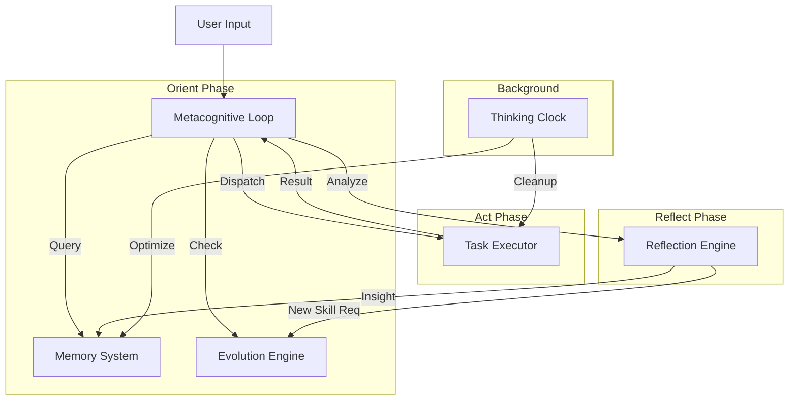

# Metacognitive System Architecture

## 1. Overview
The Metacognitive System transforms Wukong Bot from a reactive tool into a proactive, self-evolving agent. It introduces a cognitive loop that enables the bot to Observe, Orient, Decide, and Act (OODA), supported by a persistent memory of facts and reflections.

## 2. Core Components

### 2.1 Metacognitive Loop (The Brain)
**Module:** `src/worker/engine.ts` (Upgrade)
**Responsibility:** Orchestrates the lifecycle of every task.
**Flow:**
1.  **Pre-Task (Orient):**
    -   Receive Task.
    -   **Memory Recall:** Query `MemorySystem` for relevant facts (e.g., "User prefers TS", "Project uses Bun").
    -   **Skill Check:** Query `EvolutionEngine` to see if a skill exists or needs to be learned.
2.  **Execution (Act):**
    -   Dispatch to `Executor` (Agent/Tools).
3.  **Post-Task (Reflect):**
    -   **Evaluate:** Call `ReflectionEngine` to score the result.
    -   **Reflect:** Generate insights (Success patterns / Failure root causes).
    -   **Evolve:** If a new capability was successfully improvised, trigger `EvolutionEngine` to save it.

### 2.2 Enhanced Memory System (The Hippocampus)
**Module:** `src/memory/index.ts` (Refactor from `session/memory.ts`)
**Responsibility:** Stores and retrieves long-term knowledge.
**Data Types:**
-   **Facts:** Explicit knowledge (e.g., "Env is MacOS", "DB is SQLite").
-   **Reflections:** Insights from past actions (e.g., "Search before create", "Don't use `rm -rf` without asking").
-   **Procedures:** Metadata about known skills.
**Storage:** SQLite tables (`memories`, `reflections`).

### 2.3 Reflection Engine (The Critic)
**Module:** `src/reflection/index.ts`
**Responsibility:** Analyzes outcomes to drive improvement.
**Logic:**
-   **Evaluator:** Takes `TaskResult` -> Outputs `Score (0-1)` + `Critique`.
-   **Insight Generator:** Takes `Critique` -> Outputs `ActionableInsight` (e.g., "Create a skill for X").

### 2.4 Self-Evolution Engine (The Builder)
**Module:** `src/evolution/index.ts`
**Responsibility:** Acquires new capabilities.
**Strategies:**
1.  **Discovery:** Search internal skill repositories via `bytedance-find-skills`.
2.  **Creation:** Synthesize new skills via `skill-creator` logic.
    -   **Script Skills:** Generate code + wrapper.
    -   **Prompt Skills:** Generate system prompts.

### 2.5 Thinking Clock (The Heartbeat)
**Module:** `src/clock/index.ts`
**Responsibility:** Background processing when idle.
**Tasks:**
-   **Memory Consolidation:** Merge duplicate facts.
-   **Skill Optimization:** Update skill descriptions based on usage stats.
-   **Housekeeping:** Cleanup logs/temp files.

## 3. Data Flow Diagram

## 4. Implementation Strategy
1.  **Database First:** Establish schema for Memories and Reflections.
2.  **Components Second:** Implement Reflection and Evolution engines as standalone services.
3.  **Integration Third:** Rewrite the Worker Engine to weave these components into the loop.
