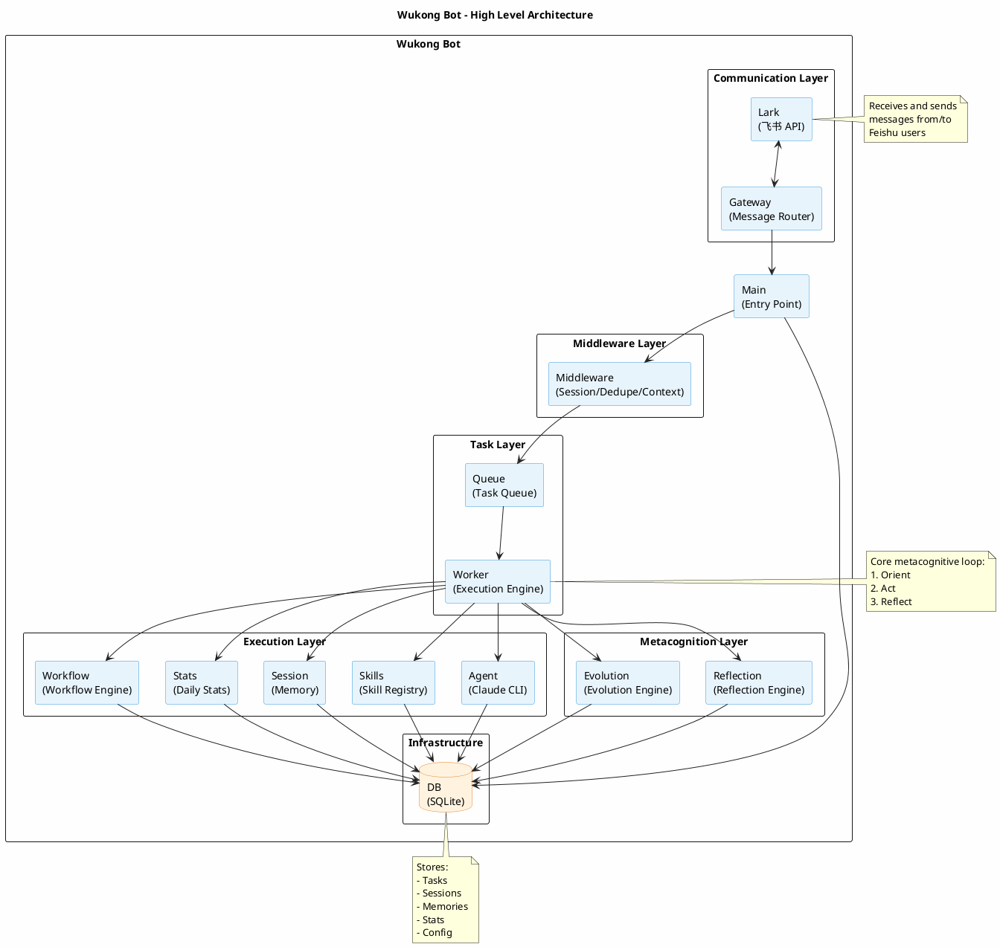

# Architecture PlantUML Implementation Plan

> **For Claude:** REQUIRED SUB-SKILL: Use superpowers:executing-plans to implement this plan task-by-task.

**Goal:** Create a high-level architecture PlantUML diagram for the Wukong Bot project.

**Architecture:** This is a simple documentation task - we will create a single PlantUML file that visualizes the project's component architecture and dependencies.

**Tech Stack:** PlantUML

---

### Task 1: Create the PlantUML Architecture Diagram

**Files:**
- Create: `architecture.puml`

**Step 1: Create the PlantUML file with package structure and components**



**Step 2: Verify the PlantUML file exists and is complete**

Run: `cat architecture.puml | head -20`
Expected: Should show the @startuml and package structure

**Step 3: Commit the file**

```bash
cd /Users/bytedance/mxg/go/src/code.byted.org/wukong-bot
git add architecture.puml
git add docs/plans/2026-03-04-architecture-plantuml-design.md
git add docs/plans/2026-03-04-architecture-plantuml-implementation.md
git commit -m "feat: add architecture PlantUML diagram"
```

---

## Plan Complete

The architecture.puml file will contain:
- All major modules/components
- Clear dependency relationships
- Data flow arrows
- Package organization by layer
- Notes explaining key components
